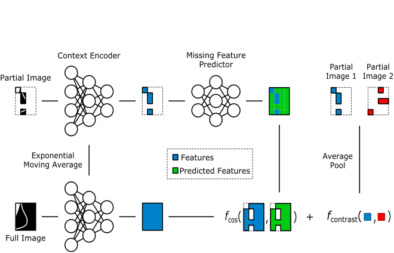

  

## Description

MiT-UB is a vision transformer model that is tailored for unbiased medical image analysis. It was designed
to accomodate the diverse nature of medical images, such as varying image sizes and resolutions, while
maintaining a high level of performance. Data scarcity is a common problem in medical image analysis,
so we adopt a self-supervised pre-training strategy to leverage unlabeled data and improve generalization to minority populations.

There are two variants of the MiT-UB model:
1. A generic Vision Transformer (ViT) backbone
2. An Adaptive Vision Transformer (AViT) backbone suited for high resolution inputs

These backbones are pre-trained under a modified Joint-Embedding Predictive Architecture (JEPA) training paradigm. The architecture and pre-training procedure make MiT-UB suited for **any tokenizable input**.

### Vision Transformer (ViT)

  <figure style="display: inline-block; margin: 20px; text-align: center;">
    
    <figcaption>Vision Transformer (ViT)</figcaption>
  </figure>

The ViT backbone of MiT-UB incorporates the following modifications to the original ViT architecture:
* Position is encoded using fractional factorized positions ([NaViT](https://arxiv.org/abs/2307.06304))
* Squared ReLU is adopted as the activation function
* Biases are omitted from both the attention and feed-forward layers
* No CLS token is used. Instead, a pooled representation of the final Transformer layer is computed
using average pooling.

### Adaptive Vision Transformer (AViT)

  <figure style="display: inline-block; margin: 20px; text-align: center;">
    
    <figcaption>Adaptive Vision Transformer (AViT)</figcaption>
  </figure>

The AViT backbone of MiT-UB builds upon the ViT backbone by incorporating a fixed-resolution pathway and
a high resolution pathway. This design was inspired by other recent works like [Perceiver](https://arxiv.org/abs/2103.03206) and [GPViT](https://arxiv.org/abs/2212.06795), which mitigate the high computational and memory requirements of standard ViTs by leveraging cross-attention mechanisms. A pooling approach similar to [ViTAR](https://arxiv.org/abs/2403.18361) is used to construct a fixed-resolution set of pooled tokens from the set of high resolution tokens. Pooled tokens act as queries and high-resolution tokens act as keys and values in the cross-attention mechanism. Multiple cross-attention blocks allow model to gradually fuse information from the high-resolution tokens into the fixed-resolution tokens.

Either max-pooling or average-pooling can be used to reduce the resolution of the high-resolution pathway.
Experimental results have shown that max-pooling tends to perform better and is more stable, so it is
adopted as the default pooling method.

### M-JEPA

  <figure style="display: inline-block; margin: 20px; text-align: center;">
    
    <figcaption>Medical Joint Embedding Predictive Architecture (M-JEPA)</figcaption>
  </figure>

To pre-train MiT-UB we adopt a modified version of the Joint-Embedding Predictive Architecture ([JEPA](https://arxiv.org/abs/2301.08243)). JEPA was chosen as the pre-training framework because:
1. It does not rely on negative samples or contrastive augmentations, enabling it to generalize to different medical image modalities and tasks.
2. It operates and latent space rather than pixel space, which is advantageous for medical data which may contain stochastically distributed tissue.

The following modifications, found through experimentation, were made to the original JEPA framework:
1. A contrastive loss is added to encourage the model to learn different representations for different images. This loss (`nn.CosineEmbeddingLoss`) is applied to the average-pooled output of the missing feature predictor.
2. Cosine similarity is used in place of MSE as the loss function for the missing feature predictor.

### Miscellaneous

In the design of MiT-UB, we find the following attributes to be significant contributors to its performance:
* The contrastive loss added to M-JEPA was crucial to avoiding mode collapse. This may be a consequence of the limited batch size used in pre-training.
* ReLU2 (squared ReLU) was found to be a superior activation function to GELU, SiLU, and common gated units.
* Any attempt to omit biases from the patch embedding layers resulted in instability during training.
* Early AViT designs placed the high-resolution pathway before the low-resolution pathway. This worked, but presented challenges in adapting a ViT backbone into an AViT backbone.

## Performance

### CIFAR-10

We use CIFAR-10 as a testbed for pre-training MiT-UB. Its low resolution makes it suboptimal for AViT, so we primarily consider ViT. A minimal set of augmentations is used for training, including random horizontal and vertical flips, and color jitter. A baseline ConvNext model, trained supervised under additional augmentations, achieves 91.6% top-1 accuracy.

|                     | ViT   | AViT  |
|---------------------|-------|-------|
| Supervised Only     | 80.3% |       |
| M-JEPA Linear Probe | 79.3% | 73.7% |
| M-JEPA LoRA         | 83.7% |       |
| M-JEPA Fine Tuning  | 87.5% |       |

### Mammography

MiT-UB has been pre-trained and evaluated on mammographic tasks including view classification, breast density assessment, and breast cancer triage. For low-resolution tasks (view classification and breast density assessment) we apply a ViT backbone at 512x384 resolution and a patch size of 16. For high-resolution tasks (breast cancer triage) we apply an AViT backbone at 3072x2304 resolution, patch size 16, and pooled size of 32x24. Training was performed on a proprietary dataset of 450k mammograms. The model achieves 99.9% accuracy on view classification by linear probing. Assessment of breast cancer triage is ongoing, however the model has achieved 0.86 AUC on an enriched test set of 800+ exams.

## Usage

Dependencies for MiT-UB are managed with [pdm](https://github.com/pdm-project/pdm). With pdm installed, you can install the dependencies for the project by running `make init`.

### Pre-training

It is recommended to implement a linear probe that runs in parallel with M-JEPA pre-training. The adversarial losses of M-JEPA are not intuitive and can fluctuate in opposing directions, so it is difficult to determine whether the model is learning. A linear probe can provide additional insight into whether this is the case. For example, in mammography, view classification as medio-lateral oblique (MLO) or craniocaudal (CC) is an appropriate proxy task. If the linear probe achieves high performance, it is likely that the M-JEPA pre-training is effective.

For mammography, multiple stages of pre-training are used. First, a ViT backbone is pre-trained for ~250k steps at 512x384 resolution. This backbone is converted to an AViT backbone and pre-trained for an additional ~150k steps at 3072x2304 resolution. Training was performed using 2-3 RTX 3090 GPUs, on which a pre-training run takes 2-3 days.

### Fine-tuning

Several options exist for fine-tuning MiT-UB. Key layers are implemented to support [LoRA](https://arxiv.org/abs/2106.09685) provided by [torchtune](https://github.com/pytorch/torchtune). End to end fine tuning using low learning rate is also an option. Experiments suggest that LoRA fine-tuning on a supervised task can yield performance gains without risk of overfitting, but end to end fine tuning yielded superior results on CIFAR-10.

AViT is structured such that a ViT backbone can easily be converted into an AViT backbone. This enables scaling to higher resolution inputs while still making use of pre-trained weights. 

## Development

The following make recipes are useful for development:
* `make style` - Runs code style formatting
* `make quality` - Tests that code complies with quality standards
* `make types` - Run static type checking with [pyright](https://github.com/microsoft/pyright)
* `make test` - Run unit tests
* `make test-pdb-*` - Run unit tests matching pattern `*` with fallback to [`pdb`](https://docs.python.org/3/library/pdb.html)
  for debugging.

## Future Work

### High Dynamic Range

Medical images often exhibit a wide dynamic range of 10-16 bits. It is unclear if mixed precision training will lose some effectiveness when training on such data. MiT-UB attempts to address this by performing patch embedding at full precision, but no experiments have been conducted to examine the impact of this decision.

### Convolutional Distillation

The M-JEPA design leverages attributes of the vision transformer, namely its permutation and cardinality invariance. This makes M-JEPA incompatible with convolutional models. However, in some circumstances, a convolutional model may be a more appropriate choice. Distilling a M-JEPA pre-trained MiT-UB model into a convolutional model is an open research question.

### Fused Kernels

There is undoubtedly room to optimize MiT-UB through the use of fused kernels or custom kernels in general.

### Mixture of Experts

Mixture of Experts (MoE) has been shown to be an effective method for scaling up neural networks. It is unclear how MiT-UB would benefit from such an approach, but it is an open research question.

### Other Medical Domains

Assessment of MiT-UB so far has been limited to CIFAR-10 and mammography. Additional datasets and tasks are needed to fully evaluate the model.

## Acknowledgements

This research was, in part, funded by the National Institutes of Health (NIH) Agreement No. 1OT2OD032581. The views and conclusions contained in this document are those of the authors and should not be interpreted as representing the official policies, either expressed or implied, of the NIH.
